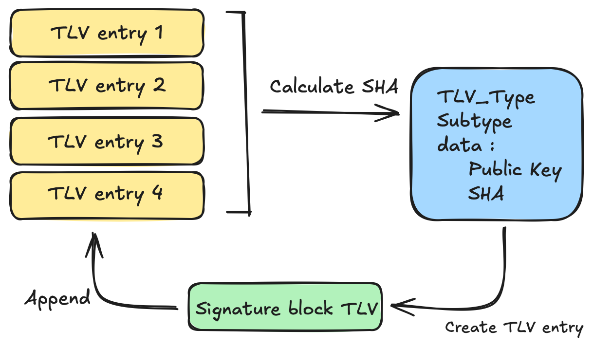

# ESP Secure Cert Secure Verification

This document explains the signature verification functionality in the ESP Secure Cert component, including secure verification integration, signature block format, and how to configure and test signature verification. This feature closely resembles with ESP-IDFs Secure Boot V2, It is highly recommended that this feature is used along with secure boot V2 feature.

### Signature block

The signature block is calculated using the SHA256/SHA384 digest of all the existing TLV entries in the partition, excluding TLVs of type `ESP_SECURE_CERT_SIGNATURE_BLOCK_TLV`.

The resulting signature block is then added to the end of the esp_secure_cert partition as a TLV entry.

#### Block Diagram



- Hash is calculated from all TLV entries except SIGNATURE_BLOCK_TLV (SHA-256 for ECDSA-192/256, SHA-384 for ECDSA-384).
- Signature Block TLV is created with the signature data and signing key.
- Signature Block TLV will be appended at the end of all entries.

### Signing key

**It is critical that the same keys used for secure boot are also used here** for signature verification.

Please note that if this feature is enabled on the device then it will be difficult to enable secure boot (if not already enabled) on that device going forward.

User may generate up to same number of signature block TLVs that are supported by Secure Boot in the hardware with corresponding signing keys.

### Signature Block Data

For signature blocks, storage differs by scheme:

**RSA:**  
The entire signature block (including all fields and padding) is stored directly in the signature TLV, exactly matching the [ESP-IDF RSA signature block structure](https://docs.espressif.com/projects/esp-idf/en/v5.5.2/esp32c5/security/secure-boot-v2.html#id6). No modifications are made; it is always 1216 bytes.

**ECDSA:**  
To save space, only the essential fields (like curve ID, public key, and signature) are stored in the TLV. Padding and extra fields are removed. At verification time, a full 1216-byte ECDSA signature block structure (for [ECDSA-192, ECDSA-256](https://docs.espressif.com/projects/esp-idf/en/v5.5.2/esp32c5/security/secure-boot-v2.html#id7), [ECDSA-384](https://docs.espressif.com/projects/esp-idf/en/v5.5.2/esp32c5/security/secure-boot-v2.html#id8)) is rebuilt in RAM, missing padding and fields are filled as required before verification.

This keeps flash usage low while maintaining compatibility during verification.

### Multiple Signature Blocks

The feature supports multiple signature blocks:
- **Signature Block 0**: Primary signature block (subtype 0)
- **Signature Block 1**: Secondary signature block (subtype 1)
- **Signature Block 2**: Tertiary signature block (subtype 2)

The verification process iterates through all available signature blocks and succeeds if any one of them passes verification. This allows for key rotation and revocation - if one signing key is revoked, the partition can still be verified using another valid key.

**NOTE:** The order of the signature blocks is determined by the order of the signing keys provided as parameters to the `configure_esp_secure_cert.py` tool, **not** by the subtype field in the signature block.

## Generating Signed Images

The `configure_esp_secure_cert.py` script provides functionality to add signature blocks to existing unsigned esp_secure_cert partition or create new signed esp_secure_cert partitions.

### Appending signature to existing esp_secure_cert partition

To add a signature block to an existing esp_secure_cert partition:

```bash
python tools/configure_esp_secure_cert.py \
    --esp-secure-cert-file path/to/existing/esp_secure_cert.bin \
    --secure-sign \
    --signing-key-file path/to/signing_private_key.pem \
    --signing-scheme ['rsa3072', 'ecdsa192', 'ecdsa256', 'ecdsa384'] \
```

### Generating new esp_secure_cert partition with signature.

To create a new esp_secure_cert binary with signature blocks:

```bash
python tools/configure_esp_secure_cert.py \
    --private-key path/to/client_private_key.pem \
    --device-cert path/to/device_cert.pem \
    --ca-cert path/to/ca_cert.pem \
    --secure-sign \
    --signing-key-file path/to/signing_private_key.pem \
    --signing-scheme ['rsa3072', 'ecdsa192', 'ecdsa256', 'ecdsa384']
    --target_chip esp32c3
```

**NOTE - The number of signature blocks are created depends upon number of keys passed to signing-key-file.**

For example, in following case two signature block will be generated.
```
--signing-key-file priv_key1.pem priv_key2.pem
```

### Command Line Options

| Option | Description | Required |
|--------|-------------|----------|
| `--esp-secure-cert-file` | Path to existing binary file | For existing binaries |
| `--signing-key-file` | Path to signing private key (PEM format); can be provided multiple times for multiple signatures | Yes |
| `--signing-scheme` | Signing scheme to use (`rsa3072`, `ecdsa192`, `ecdsa256`, `ecdsa384`) | Yes |
| `--secure-sign` | To enable the signature block feature | Yes |

### Output Files

The script generates the following files in the `esp_secure_cert_data/` directory:
- `esp_secure_cert_signed_partition.bin`: Final signed binary file
- `signature_block_0.bin`: Primary signature block
- `signature_block_1.bin`: Secondary signature block (if multiple keys provided)
- `signature_block_2.bin`: Tertiary signature block (if multiple keys provided)

## Secure Verification

The ESP Secure Certificate Manager component provides a ready API for signature verification that integrates with ESP-IDF's secure boot system. The signature verification should ideally be performed at application startup to ensure the integrity and authenticity of the esp_secure_cert partition before consuming its contents.

### API Usage

Before using the signature verification API, make sure to enable the `CONFIG_ESP_SECURE_CERT_SECURE_VERIFICATION` configuration option in your project:

```c
#include "esp_secure_cert_signature_verify.h"

void app_main()
{
#if CONFIG_ESP_SECURE_CERT_SECURE_VERIFICATION
    // Perform signature verification at startup
    ESP_LOGI(TAG, "Starting esp_secure_cert partition signature verification...");
    esp_err_t sig_ret = esp_secure_cert_verify_partition_signature(NULL);
    if (sig_ret == ESP_OK) {
        ESP_LOGI(TAG, "esp_secure_cert partition signature verification PASSED");
    } else {
        ESP_LOGE(TAG, "esp_secure_cert partition signature verification FAILED");
    }
#endif
    
    // Continue with normal application logic...
}
```

**NOTE - Pass `NULL` as parameter to this API, as `esp_sign_verify_ctx_t` context is for compatibility reason and not currently used**

## Configuration Requirements

### Enable Secure Verification

To use signature verification, enable the following configuration in your project:

```bash
# Enable secure verification
idf.py menuconfig
```

Navigate to: `Component config` → `ESP Secure Certificate` → `Enable secure verification support`

Or add to your `sdkconfig.defaults`:
```
CONFIG_ESP_SECURE_CERT_SECURE_VERIFICATION=y
```

### Partition Configuration

The esp_secure_cert partition will be automatically flashed when you build and flash your application this is only true for **examples/esp_secure_cert_app**, and for other application user need to flash the esp_secure_cert partition manually:

```bash
idf.py build flash
```

The partition table should include:
```
# Name,   Type, SubType, Offset,  Size, Flags
nvs,      data, nvs,     0x9000,  0x6000,
phy_init, data, phy,     0xf000,  0x1000,
factory,  app,  factory, 0x10000, 1M,
esp_secure_cert, data, 0x3f, 0x20000, 0x10000,
```

## Testing with QEMU

For testing signature verification functionality, it's recommended to use QEMU to avoid potential issues with real hardware during development.

### Setting Up QEMU Testing

To use signature verification, enable the following configuration in your project:

```bash
# Enable secure boot verification
idf.py menuconfig
```

Navigate to: `Component config` → `ESP Secure Certificate` → `Enable secure verification support`

Or add to your `sdkconfig.defaults`:
```
CONFIG_ESP_SECURE_CERT_SECURE_VERIFICATION=y
```

Then run qemu, the firmware will be built automatically.

```bash
# Enable secure boot verification
idf.py qemu
```
