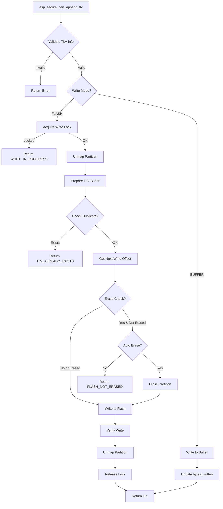
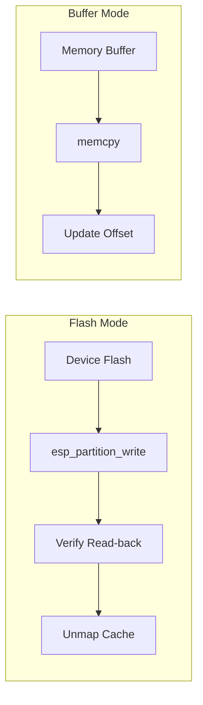
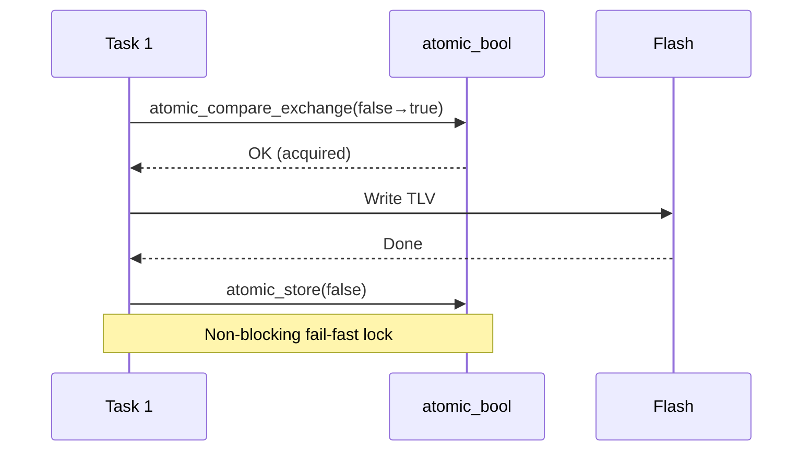
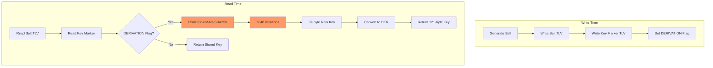
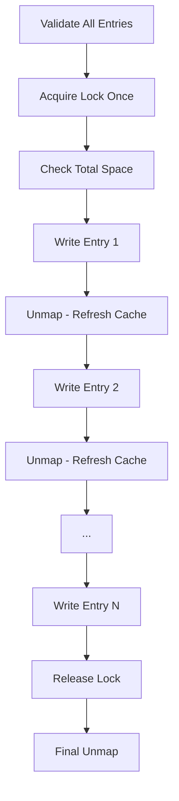

# ESP Secure Cert Write Support

This document describes the write support architecture for the `esp_secure_cert` partition.

## Overview

The write APIs enable runtime modification of the `esp_secure_cert` partition, supporting:
- Direct flash writes (on-device provisioning)
- Buffer writes (host-side partition generation)
- HMAC-based encryption and key derivation

## Write Flow



## TLV Structure

Each TLV entry written to flash:

```
┌─────────────────────────────────────────────────────────────┐
│                    TLV Header (12 bytes)                    │
├─────────┬────────┬────────┬──────────┬─────────┬───────────┤
│  Magic  │ Flags  │  Type  │ Subtype  │ Length  │ Reserved  │
│ 4 bytes │ 1 byte │ 1 byte │  1 byte  │ 2 bytes │  3 bytes  │
├─────────┴────────┴────────┴──────────┴─────────┴───────────┤
│                     Data (variable)                         │
├─────────────────────────────────────────────────────────────┤
│                 Padding (16-byte aligned)                   │
├─────────────────────────────────────────────────────────────┤
│                   TLV Footer (4 bytes)                      │
│                       CRC32                                 │
└─────────────────────────────────────────────────────────────┘
```

## Write Modes



| Mode | Use Case | Verification |
|------|----------|--------------|
| `FLASH` | On-device provisioning | Read-back + CRC |
| `BUFFER` | Host partition generation | None (in-memory) |

## Concurrency Control



The write lock uses `atomic_compare_exchange_strong()` for:
- Thread-safe access without OS primitives
- Non-blocking fail-fast behavior
- Minimal overhead (1 byte)

## HMAC-based ECDSA Key Derivation



**Key never stored in flash** - derived on-demand from:
- Salt (stored in partition)
- HMAC key (stored in eFuse, inaccessible to software)

## Batch Write Optimization



Benefits:
- Single lock acquisition for all entries
- Upfront validation prevents partial writes
- Cache refresh between entries ensures correct offsets

## Error Code Categories

| Range | Category |
|-------|----------|
| `0x7001-0x7005` | TLV validation errors |
| `0x700A-0x700F` | Partition/flash errors |
| `0x7014-0x7017` | Config/buffer errors |
| `0x701E-0x7020` | HMAC encryption errors |
| `0x7028-0x7029` | Memory errors |
| `0x7032` | Concurrency error |
| `0x703C-0x7041` | ECDSA derivation errors |

## Configuration Structure

```c
typedef struct {
    esp_secure_cert_write_mode_t mode;
    union {
        struct {
            bool check_erase;    // Verify erased before write
            bool auto_erase;     // Auto-erase if needed
        } flash;
        struct {
            uint8_t *buffer;     // Target buffer
            size_t buffer_size;  // Buffer capacity
            size_t *bytes_written; // Output: actual size
        } buffer;
    };
    uint32_t reserved[4];        // Future extensions
} esp_secure_cert_write_config_t;
```

The `reserved` field ensures API/ABI compatibility for future enhancements.

## See Also

- [TLV Format](format.md) - Partition format details
- [esp_secure_cert_write.h](../include/esp_secure_cert_write.h) - API reference
- [README.md](../README.md) - Usage examples
